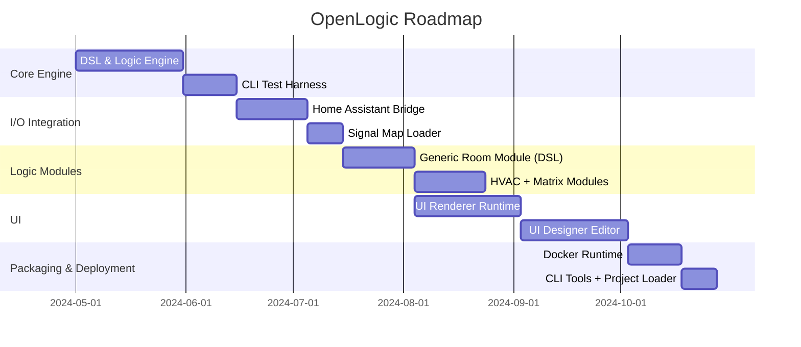

# Gantt Chart — OpenLogic Development

```mermaid
gantt
    title OpenLogic Roadmap
    dateFormat  YYYY-MM-DD
    section Core Engine
    DSL & Logic Engine         :a1, 2024-05-01, 30d
    CLI Test Harness           :a2, after a1, 15d

    section I/O Integration
    Home Assistant Bridge      :b1, after a2, 20d
    Signal Map Loader          :b2, after b1, 10d

    section Logic Modules
    Generic Room Module (DSL) :c1, after b2, 20d
    HVAC + Matrix Modules      :c2, after c1, 20d

    section UI
    UI Renderer Runtime        :d1, after c1, 30d
    UI Designer Editor         :d2, after d1, 30d

    section Packaging & Deployment
    Docker Runtime             :e1, after d2, 15d
    CLI Tools + Project Loader :e2, after e1, 10d
```
